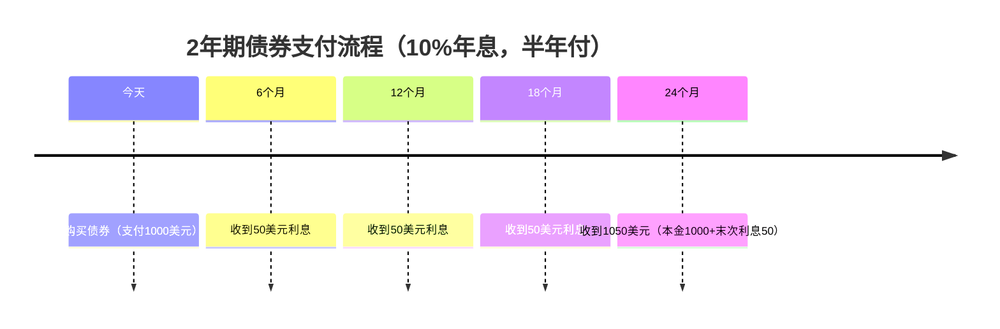

---
up:
  - "[[Fin Tools 金融工具 MOC]]"
related:
  - "[[金融与资本市场-可汗学院 Unit 6 股票与保险]]"
created: 2025-07-19
tags:
  - domain/econ-fin
---

### **债券基础概念卡片笔记**

#### **1. 债券的本质**
- **定义**：债券是企业向投资者借款的凭证，持有人成为企业的债权人（而非股东）。
- **核心功能**：企业融资的替代方案（相比发行股票或银行贷款）。
- **典型案例**：  
  - 公司资产1000万美元，无负债  
  - 需融资500万美元建工厂 → 选择发行债券而非增发股票

---

#### **2. 债券 vs 股票融资对比**
| **维度**       | **债券**                          | **股票**                          |
|----------------|-----------------------------------|-----------------------------------|
| **资金性质**   | 债务（需还本付息）                | 股权（永久性资本）                |
| **回报形式**   | 固定利息（如10%年息）             | 分红+股价增值（不固定）           |
| **风险等级**   | 优先受偿（破产时高于股东）        | 剩余索取权（风险更高）            |
| **控制权**     | 无投票权                          | 享有股东权利                      |

**资产负债表影响**：  
- **发债**：资产↑500万（现金），负债↑500万（债券）  
- **发股**：资产↑500万（现金），权益↑500万（新增股份）  

---

#### **3. 债券关键条款**
- **面值（Par Value）**：单张债券标定金额（如1000美元）  
- **票面利率（Coupon Rate）**：年化利息比例（如10%→100美元/年）  
- **到期日（Maturity）**：还本付息截止时间（如2年后）  
- **付息频率**：通常每半年付息一次（如10%年息=每6个月付50美元）  

**名称由来**：  
历史上债券附带"息票"，持有人剪下息票兑换利息，故称"Coupon Payment"。

---

#### **4. 债券现金流示例（1000美元面值）**

---

#### **5. 企业发债动机**
- **避免股权稀释**：不增加股东数量，保持控制权  
- **税务优势**：利息可抵税（降低企业应税利润）  
- **灵活融资**：面向公众分散借款（如5000人各借1000美元→500万美元）  

**风险提示**：  
到期需一次性偿还本金，企业可能面临再融资压力（发新债还旧债）。

---

#### **关键总结**
债券是"标准化借条"，平衡了企业融资需求与投资者收益稳定性。其固定收益特性适合风险厌恶型投资者，而企业则需权衡财务杠杆与偿债能力。