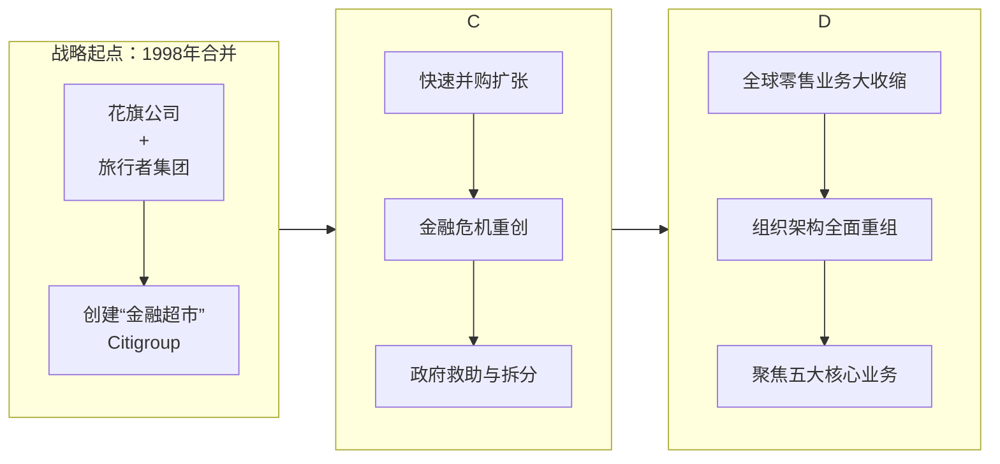

---
up:
  - "[[Econ Fin Event 经济金融事件]]"
related:
  - "[[财务报表分析与证券估值-CH03 财务报表在估值中的应用]]"
  - "[[1933年 美国 格拉斯-斯蒂格尔法案]]"
created: 2025-12-19
tags:
  - domain/econ-fin
---

花旗集团的合并史，最核心、影响最深远的无疑是**1998年与旅行者集团的合并**，它不仅是金融史上的一次地震，也成为了集团后续几十年战略扩张、整合乃至当前重大重组的历史原点。

下面的表格可以帮助你快速了解这次关键合并的概况：

| 项目 | 详情 |
| :--- | :--- |
| **合并时间** | 1998年4月 |
| **合并双方** | 花旗公司 (Citicorp) 与 旅行者集团 (Travelers Group) |
| **交易规模** | 约820亿美元（按当时汇率计算） |
| **合并背景** | 旨在打造覆盖银行、证券、保险等业务的“金融超市”。直接挑战当时美国禁止银行与保险公司合并的《格拉斯-斯蒂格尔法案》。 |
| **核心目标** | 实现**优势互补**：结合花旗的全球银行网络、客户基础与旅行者的保险、资产管理及投资银行业务。 |

### 🔗 从合并到重组的战略脉络
1998年的合并深刻塑造了花旗集团后续的发展轨迹。你可以从下图中了解其战略演变的主线：

#### **合并后的扩张与整合难题（1999-2009）**
合并后，花旗集团通过一系列收购快速扩张，但在追求“金融超市”的过程中也面临巨大挑战：
*   **管理文化冲突**：合并初期实行“双巨头”管理模式，原花旗与旅行者的管理层在控制权、文化上存在冲突，导致内部整合缓慢。
*   **协同效应未达预期**：尽管初期通过花旗渠道销售旅行者年金取得一定成效，但保险业务的专业性与银行业务的融合难度很大。最终，花旗在2002年和2005年先后剥离了旅行者的财产险和寿险业务。
*   **金融危机的重创**：2008年全球金融危机中，花旗因在次贷相关产品上损失惨重而濒临崩溃。这迫使美国政府对其进行了大规模救助，并持有其大量股份。为获得救助，花旗将自身拆分为“花旗银行”（专注核心银行业务）和“花旗控股”（持有待处置的非核心高风险资产）两部分。

#### **当前的战略重组与“简化”（2021年至今）**
为彻底走出阴影并提升竞争力，现任CEO简·弗雷泽自2021年起领导了花旗**数十年来最大规模的重组**，核心是**从“金融超市”模式转向“简化”与“聚焦”**：
*   **大规模业务剥离**：全面退出亚洲、欧洲、中东和非洲等14个市场的**零售银行业务**。近期，也完成了对墨西哥银行业务**Banamex**的战略剥离。
*   **组织架构扁平化**：将管理层级从13层大幅削减至8层，并将所有五大核心业务（交易、银行、服务、财富管理和美国消费者产品）的负责人直接向CEO汇报。
*   **财务与人员精简**：计划裁员约2万人以节省成本，目标是到2027年将关键盈利指标（有形普通股权益回报率）提高至至少11%。

### 💎 核心影响与评价
1998年的合并之所以被视为里程碑，关键在于其**超越商业范畴的历史性影响**：
*   **推动金融立法**：此次合并直接挑战并最终加速了美国 **《金融服务现代化法案》（即Gramm-Leach-Bliley Act）在1999年的出台** ，正式废除了分业经营限制，开启了美国金融业混业经营的新时代。
*   **定义一种模式**：它创造了“金融超市”或“全能银行”的终极范本，成为此后全球大型金融机构效仿或警惕的对象。
*   **提供深刻教训**：合并后的整合困难、文化冲突以及在金融危机中暴露的风险管理问题，为全球金融业的并购与综合化经营提供了极其宝贵的教训。

总的来说，1998年的合并是花旗集团成为金融巨头的起点，也是理解其后续所有战略调整——包括当前这场旨在“简化”的大重组——的根本前提。

如果你想深入了解某一具体阶段，比如金融危机时期的拆分细节，或是当前重组的最新进展，我可以为你提供更详细的信息。